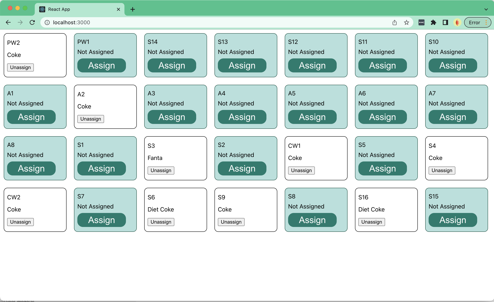
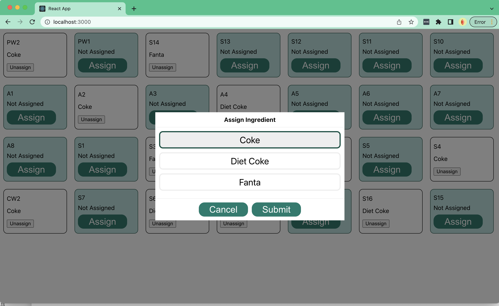

# Ingredient Assignment

This sample project demonstrates how to use the kOS UI SDK to create frontend applications that can model and render Holder and Ingredient data on a dispenser as part of a Non-Consumer User Interface (NCUI).

After starting up the sample kOS System Application and running the UI you should see the following list of dispenser Holders displayed:

Users should be able to assign and un-assign ingredients from holders:

## Data Flow

The overall flow of information is captured here:

### Startup

1.  On startup the UI will initialize the Dispenser (Root) model.
2.  The dispenser model has a declared dependency on the Ingredient collection which means it will be initialized and loaded as part of the startup process.
3.  The ingredient model, as part of it's load lifecycle hook, will call the backend to retrieve the list of available ingredients.
4.  The ingredient container model will instantiate Ingredient models based on the returned payload.
5.  The dispenser model will query the backend for the baseline list of holders. The results will be used to instantiate Holder models.
6.  The dispenser model will query the backend for the base list of ingredient assignments. The result will be used to augment the assignment information in the holders.
7.  The dispenser model will register topic listeners in order to be notified for any assignment additions or deletions.

### Assignment

1.  The UI will render the list of holders and assignments based on the information stored in the model layer.
2.  A user can select a holder and choose to assign an ingredient. The list of available ingredients will be displayed.
3.  Upon selection, the UI will call the appropriate holder model to make assignment/un-assignment requests.
4.  Responses will be received asynchronously via the websocket connection.
5.  The registered topic handlers will be responsible for taking the small event messages and translating them into state changes on the appropriate holder model.
6.  The UI will reflect the changes based on updates to the underlying models.

This project was bootstrapped with [Create React App](https://github.com/facebook/create-react-app) using the kOS UI SDK Template

## Getting Started

### Available Scripts

In the project directory, you can run:

#### `npm start`

Runs the app in the development mode.\
Open [http://localhost:3000](http://localhost:3000) to view it in the browser.

The page will reload if you make edits.\
You will also see any lint errors in the console.

#### `npm test`

Launches the test runner in the interactive watch mode.\
See the section about [running tests](https://facebook.github.io/create-react-app/docs/running-tests) for more information.

#### `npm run build`

Builds the app for production to the `build` folder.\
It correctly bundles React in production mode and optimizes the build for the best performance.

The build is minified and the filenames include the hashes.\
Your app is ready to be deployed!

See the section about [deployment](https://facebook.github.io/create-react-app/docs/deployment) for more information.

#### `npm run eject`

**Note: this is a one-way operation. Once you `eject`, you can’t go back!**

If you aren’t satisfied with the build tool and configuration choices, you can `eject` at any time. This command will remove the single build dependency from your project.

Instead, it will copy all the configuration files and the transitive dependencies (webpack, Babel, ESLint, etc) right into your project so you have full control over them. All of the commands except `eject` will still work, but they will point to the copied scripts so you can tweak them. At this point you’re on your own.

You don’t have to ever use `eject`. The curated feature set is suitable for small and middle deployments, and you shouldn’t feel obligated to use this feature. However we understand that this tool wouldn’t be useful if you couldn’t customize it when you are ready for it.

### Learn More

You can learn more in the [Create React App documentation](https://facebook.github.io/create-react-app/docs/getting-started).

To learn React, check out the [React documentation](https://reactjs.org/).
